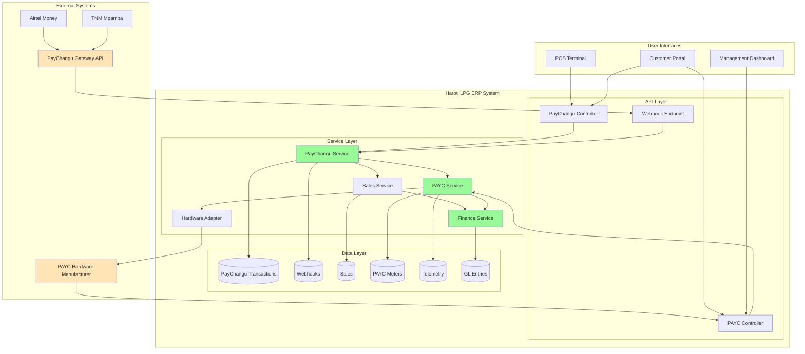
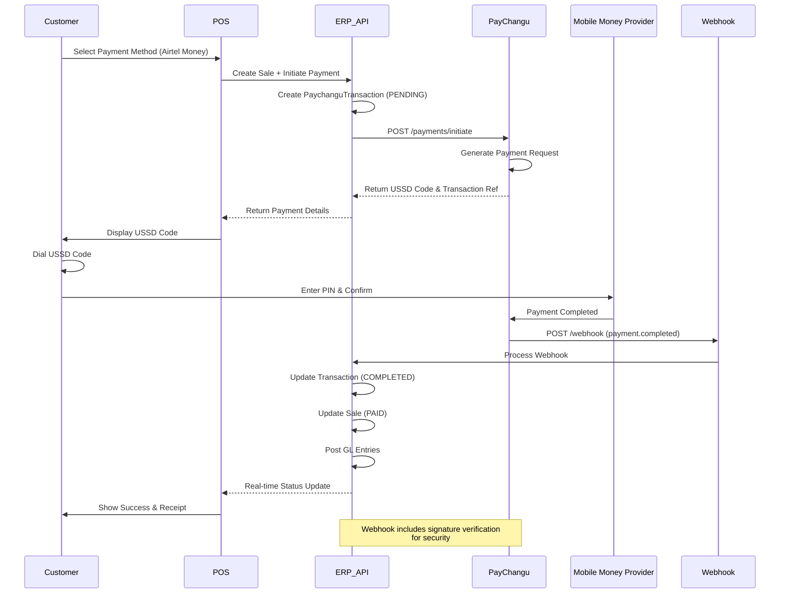
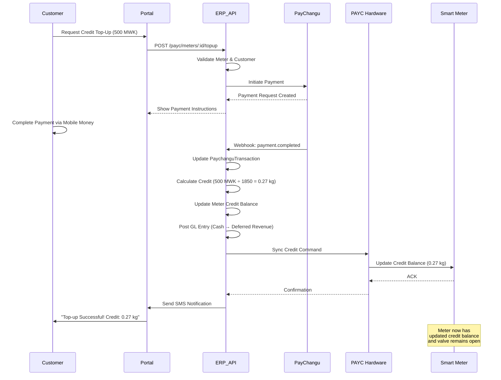
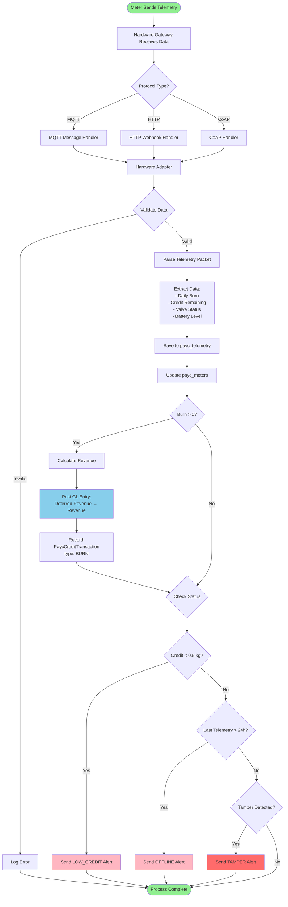
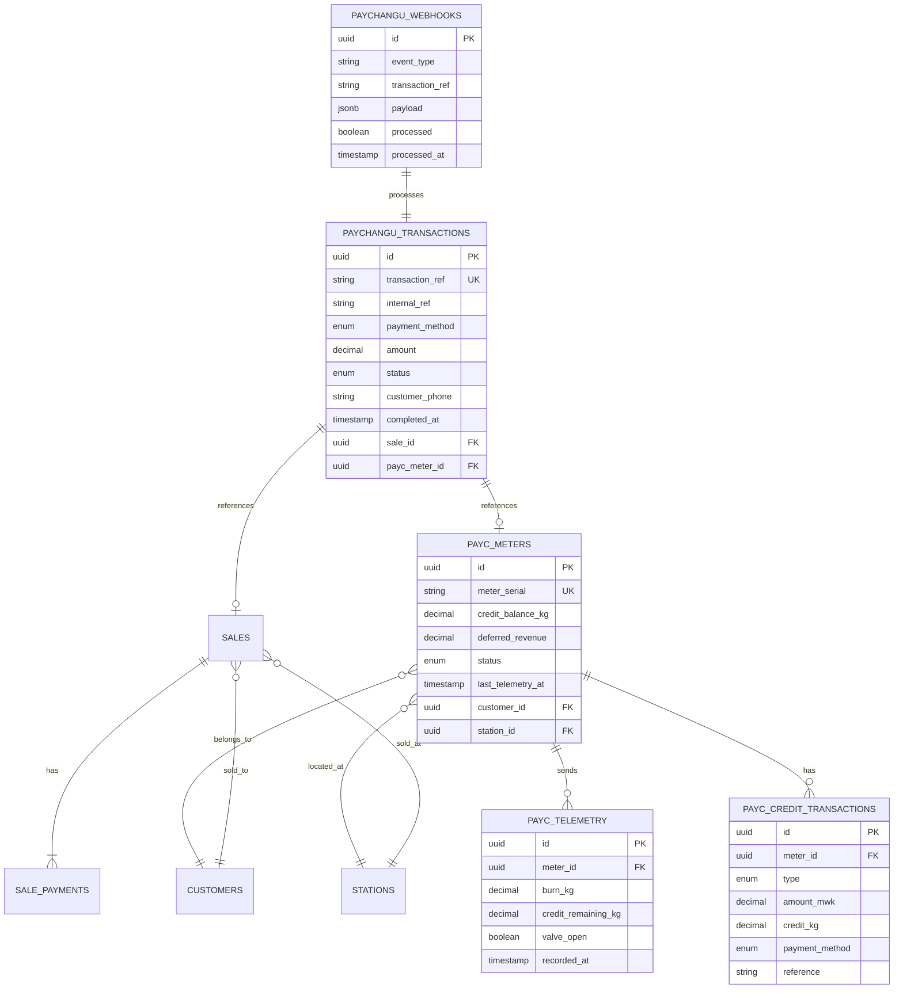
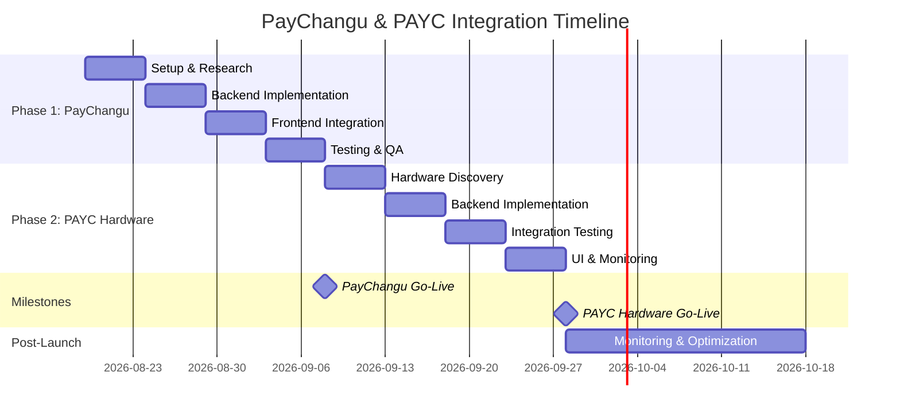
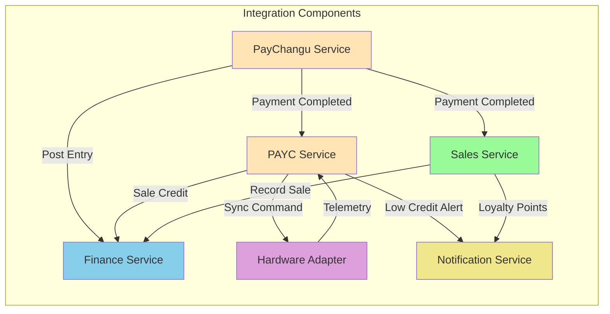
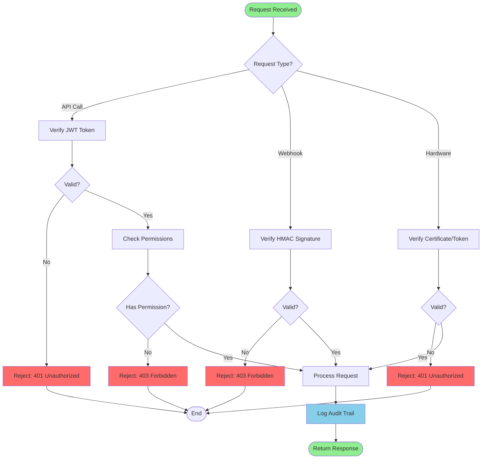
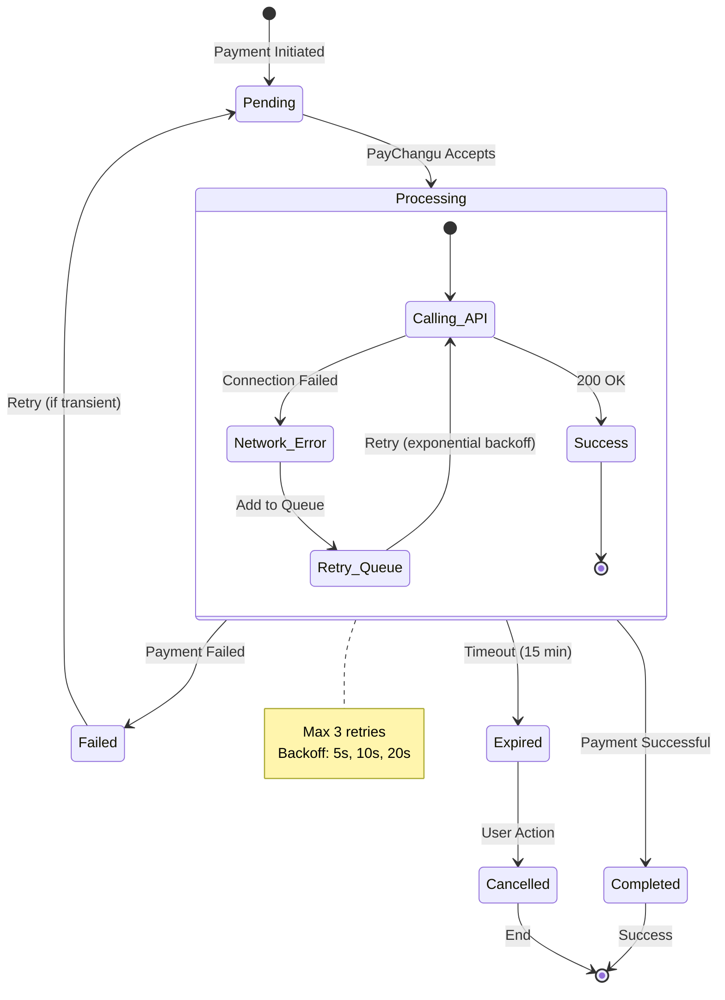

# PayChangu & PAYC Integration - Visual Diagrams

## System Integration Architecture

## Payment Flow Sequence Diagram

## PAYC Top-Up & Credit Sync Flow

## PAYC Telemetry Processing Flow

## Database Schema Relationships

## Implementation Phase Timeline

## Component Interaction Matrix

## Security & Authentication Flow

## Error Handling & Retry Strategy

---

## Legend

### Status Colors
- 🟢 **Green** - Success states, ready components
- 🟡 **Yellow** - Processing, in-progress
- 🔴 **Red** - Error states, alerts
- 🔵 **Blue** - Data operations, GL posting
- 🟣 **Purple** - Hardware operations
- 🟠 **Orange** - External systems

### Icons
- 📱 Mobile Money Providers
- 💳 Payment Gateway
- 📡 Hardware Communication
- 💾 Database Operations
- 🔐 Security & Authentication
- 📊 Monitoring & Analytics

---

**Document Version**: 1.0  
**Last Updated**: August 17, 2026  
**Diagram Tool**: Mermaid (embedded in Markdown)

For best viewing experience, render these diagrams using:
- GitHub (native support)
- VS Code with Mermaid extension
- Mermaid Live Editor: https://mermaid.live
